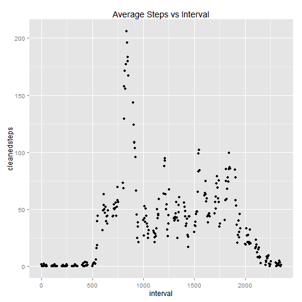

##General Document Usage
This is an R Markdown document. Markdown is a simple formatting syntax for authoring HTML, PDF, and MS Word documents. For more details on using R Markdown see <http://rmarkdown.rstudio.com>.

When you click the **Knit** button a document will be generated that includes both content as well as the output of any embedded R code chunks within the document. You can embed an R code chunk like this:

##Start of Assignment Specific Code

###This section is all about getting the data and then preparing it for analysis
### Loading and preprocessing the data

 Step 1 - Data is read after setting the working folder
 
 Step 2 - A function (calculateMeanForanInterval) is created which will be run for each row of the data. Thsi function will take the interval and steps data and if there is an "NA" value will calculate the mean for this interval  across all days and substitute that into a new column cleanedsteps 
 
 Step 3 - create a new column which stores whether the date is a weekend or not.
 
 Step 4 - Show summary of cleaned data
            


```r
#set working directory and read data
setwd("C:/Development/Reproducible Research/wk-2/Assignment/activity")
mydata=read.csv("activity.csv")
#convert date column to date type
mydata$date<- as.Date(mydata$date)

#function to return average of step across the same interval if "NA" 
calculateMeanForanInterval <- function(intervals,step) {

  if (is.na(step))
    {
      dayActivity<-mean(subset(mydata,interval==intervals & !is.na(steps))$steps)
    }
  else
    {
      dayActivity<-step
    }
   
  return(dayActivity)
}

#create new cleanedsteps column
mydata$cleanedsteps<-mapply(calculateMeanForanInterval,mydata$interval,mydata$steps)

#create new isweekend column
mydata$Isweekend<-ifelse(weekdays(mydata$date) == "Saturday" | weekdays(mydata$date) == "Sunday", 
1, 0) 
#show summary of cleaned data
summary(mydata)
```

```
##      steps             date               interval       cleanedsteps   
##  Min.   :  0.00   Min.   :2012-10-01   Min.   :   0.0   Min.   :  0.00  
##  1st Qu.:  0.00   1st Qu.:2012-10-16   1st Qu.: 588.8   1st Qu.:  0.00  
##  Median :  0.00   Median :2012-10-31   Median :1177.5   Median :  0.00  
##  Mean   : 37.38   Mean   :2012-10-31   Mean   :1177.5   Mean   : 37.38  
##  3rd Qu.: 12.00   3rd Qu.:2012-11-15   3rd Qu.:1766.2   3rd Qu.: 27.00  
##  Max.   :806.00   Max.   :2012-11-30   Max.   :2355.0   Max.   :806.00  
##  NA's   :2304                                                           
##    Isweekend     
##  Min.   :0.0000  
##  1st Qu.:0.0000  
##  Median :0.0000  
##  Mean   :0.2623  
##  3rd Qu.:1.0000  
##  Max.   :1.0000  
## 
```

### What is mean total number of steps taken per day?

```r
#sums the steps by day
summarizedByDay<-aggregate(mydata["cleanedsteps"], by=mydata["date"], FUN=sum, na.rm=TRUE)

#mean of clean steps
paste("Mean of steps by day ", + round(mean(summarizedByDay$cleanedsteps),2))
```

```
## [1] "Mean of steps by day  10766.19"
```

```r
#median of the clean steps
paste("Median of steps by day ", +round(median(summarizedByDay$cleanedsteps),2))
```

```
## [1] "Median of steps by day  10766.19"
```

```r
#histogram of the clean steps
hist(summarizedByDay$cleanedsteps,breaks=20, main="Histogram", xlab="No of steps for each day")
```

 
### What is the average daily activity pattern?

```r
#average steps for each interval
summarizedByInterval<-aggregate(mydata["cleanedsteps"], by=mydata["interval"], FUN=mean, na.rm=TRUE)

library(ggplot2)
```

```
## Warning: package 'ggplot2' was built under R version 3.1.2
```

```r
#plot steps against the interval
qplot(interval,cleanedsteps,data=summarizedByInterval, main="Average Steps vs Interval")
```

 

```r
#get the interval with the max steps
maxCleanedSteps<-max(summarizedByInterval$cleanedsteps)
paste("The interval with max steps is ", subset(summarizedByInterval,cleanedsteps==maxCleanedSteps)$interval)
```

```
## [1] "The interval with max steps is  835"
```
### Are there differences in activity patterns between weekdays and weekends?


```r
#average steps for each interval and Isweekend
summarizedByIntervalIsweekend<-aggregate(mydata["cleanedsteps"], by=mydata[c("interval","Isweekend")], FUN=mean, na.rm=TRUE)

#plot steps against the interval comparing weekend vs non-weekend
qplot(interval,cleanedsteps,main="Average Steps vs Interval-(1) is weekend and (0) is weekday", data=summarizedByIntervalIsweekend,facets=Isweekend~.)
```

 


